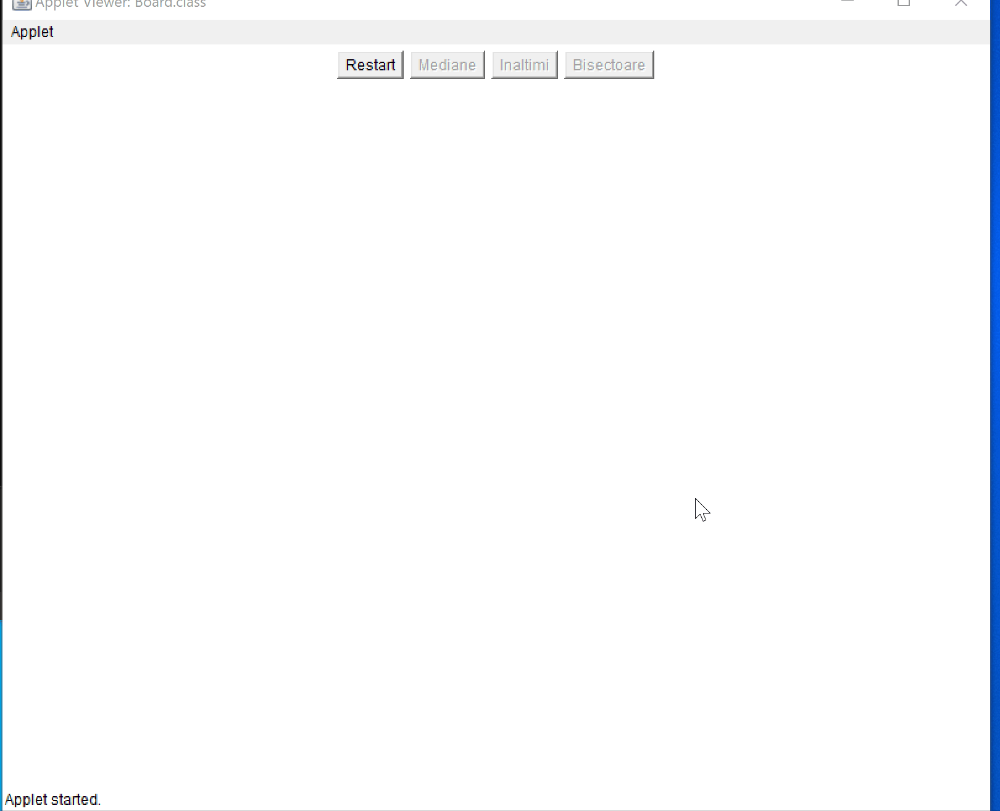
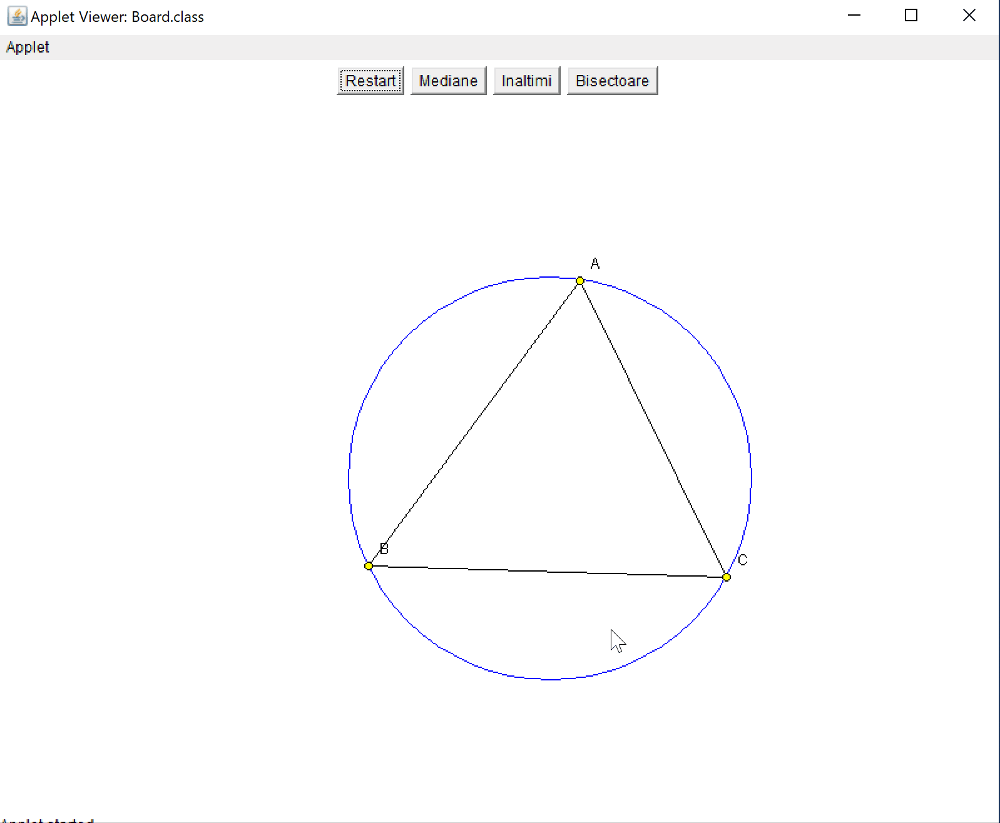
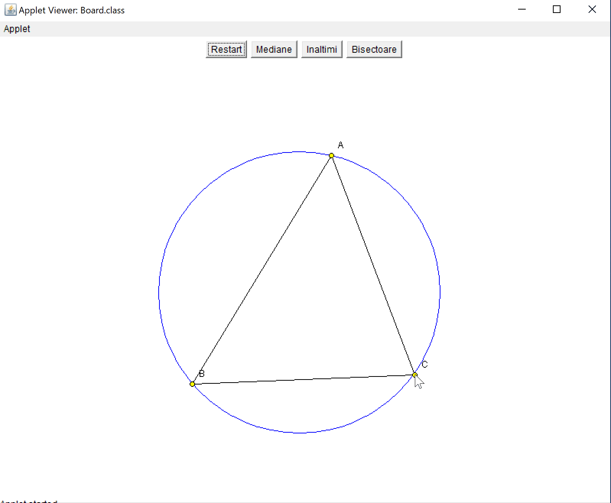
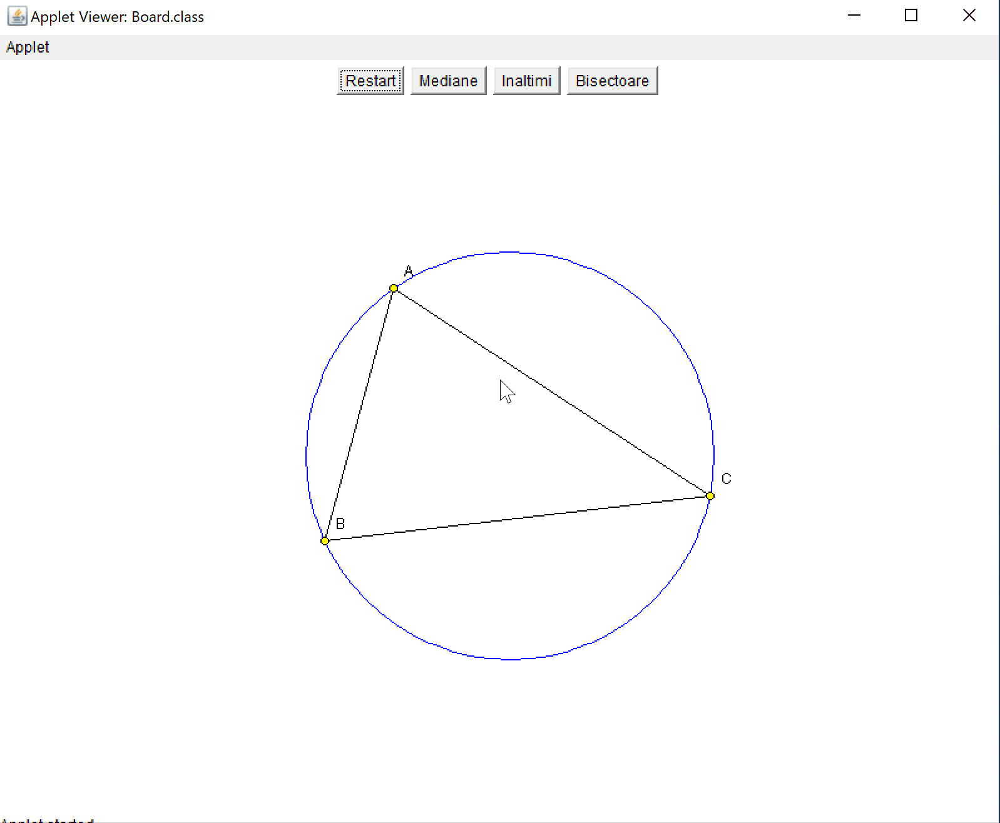
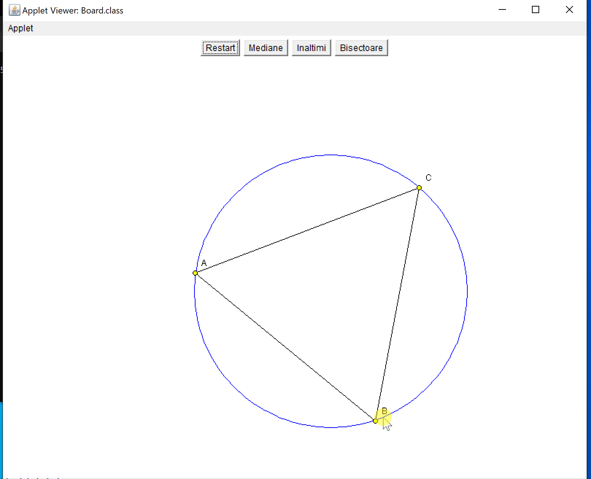
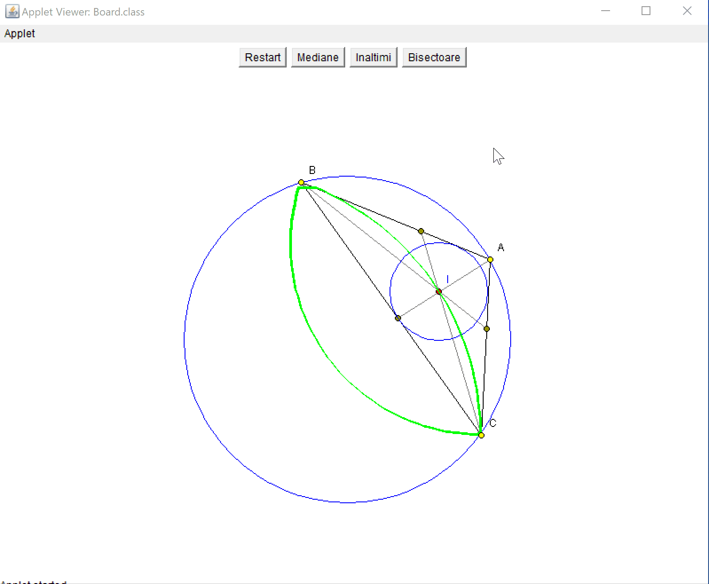

img{

}

# TriangleWhiteBoard

# Project requirements:
 * On a white background the user should be able to add dots with right-clicks. Once there're 3 dots added on the screen, they'll form a triangle. Draw it's circumscribed circle.
 * There must be 4 buttons at the top of the screen: "Restart", "Heights", "Medians" and "Bisectors".
     1. The "Medians" button will draw the medians inside the triangle.
     1. The "Bisectors" button will draw the bisectors indside the triangle.
     1. The "Heights" button will draw the heights inside the triangle.
     1. The intersections of the special lines will be marked with a red dot.
     1. The "Restart" button will clear the white board and let the user to start over.
     1. While the triangle is not complete, the "Medians", "Bisectors" and "Heights" buttons will remain <b>inactive</b>.
 * The main 3 dots can be mouse-dragged around the circumscribed circle. The triangle will change accordingly. If present, the red dot inside the triangle will leave a green trace.
 * The circumscribed circle can be resized through a mouse-drag. The triangle will change accordingly. 
 
# Rezults:
### The creation of the triangle:

### The resizing of the circle:

###  The "Bisectors" button: 

### The "Medians" button:

### The "Heights" button:

### The "Restart" button:

